---
## Front matter
lang: ru-RU
title: Лабораторная работа №5
subtitle: Настройка рабочей среды
author:
  - Губайдуллина Софья Романовна
institute:
  - Российский университет дружбы народов, Москва, Россия
date: 16 марта 2024

## i18n babel
babel-lang: russian
babel-otherlangs: english

## Formatting pdf
toc: false
toc-title: Содержание
slide_level: 2
aspectratio: 169
section-titles: true
theme: metropolis
header-includes:
 - \metroset{progressbar=frametitle,sectionpage=progressbar,numbering=fraction}
 - '\makeatletter'
 - '\beamer@ignorenonframefalse'
 - '\makeatother'
---

# Вводная часть

## Актуальность

Актуальность лабораторной работы заключается в потребности использовать менеджеры паролей pass и работы с chezmoi.

## Объект и предмет исследования

Обьект исследования: менеджеры паролей pass, шрифты и chezmoi.
Предмет исследования: работа и настройка pass, установка шрифтов и дополнительного ПО, работа с chezmoi.

## Цели 

Освоение навыков работы с менеджерами паролей pass и работы с chezmoi.

## Задачи

1) Менеджер паролей pass;
2) Настройка интерфейса с броузером;
3) Управление файлами конфигурации;
4) Создание собственного репозитория с помощью утилит и подключение его к своей системе.

# Выполнение лабораторной работы

## Менеджер паролей pass

При помощи команд в терминале устанавливаем pass (рис. [-@fig:001]).

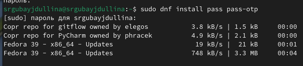{#fig:001 width=80%}

## Менеджер паролей pass

Устанавливаю gopass (рис. [-@fig:002]).

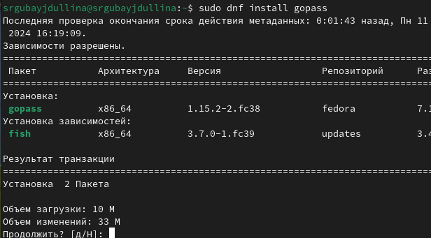{#fig:002 width=80%}

## Менеджер паролей pass

Результат установки gopass (рис. [-@fig:003]).

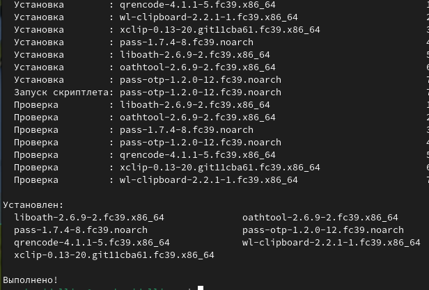{#fig:003 width=80%}

## Менеджер паролей pass 

Проверяю наличие PGP-ключей (рис. [-@fig:004]).

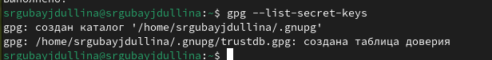{#fig:004 width=80%}

## Менеджер паролей pass 

Создаю новый PGP-ключ (рис. [-@fig:005]).

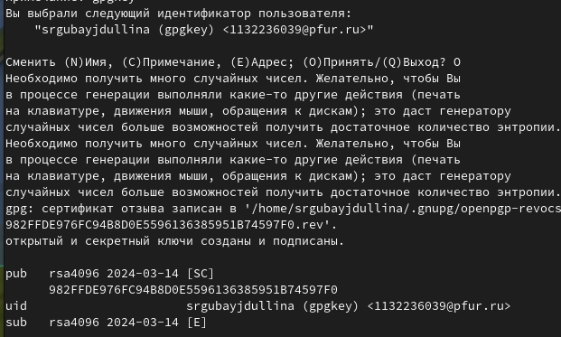{#fig:005 width=80%}

## Менеджер паролей pass 

Инициализирую хранилище (рис. [-@fig:006]). 

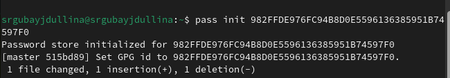{#fig:006 width=80%}

## Менеджер паролей pass 

Создаю структуру git (рис. [-@fig:007]).

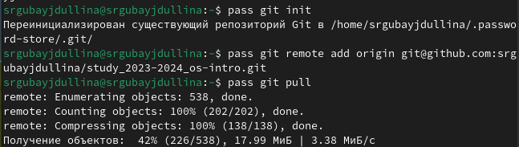{#fig:007 width=80%}

## Менеджер паролей pass 

Задаю адрес репозитория на хостинге, после чего выполняю команды pass git pull и
pass git push (рис. [-@fig:008])

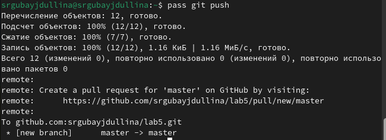{#fig:008 width=80%}

## Настройка интерфейса с броузером

Подключаюсь к browserpass (рис. [-@fig:009]).

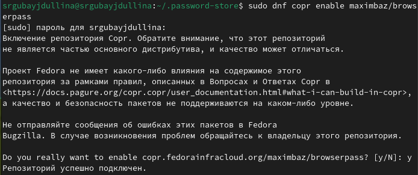{#fig:009 width=80%}

## Настройка интерфейса с броузером

Произвожу установку (рис. [-@fig:010]). 

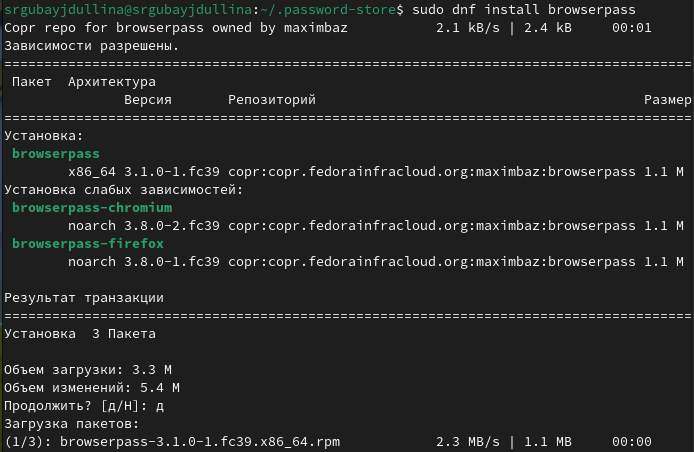{#fig:010 width=80%}

## Настройка интерфейса с броузером

Результаты установки (рис. [-@fig:011]).

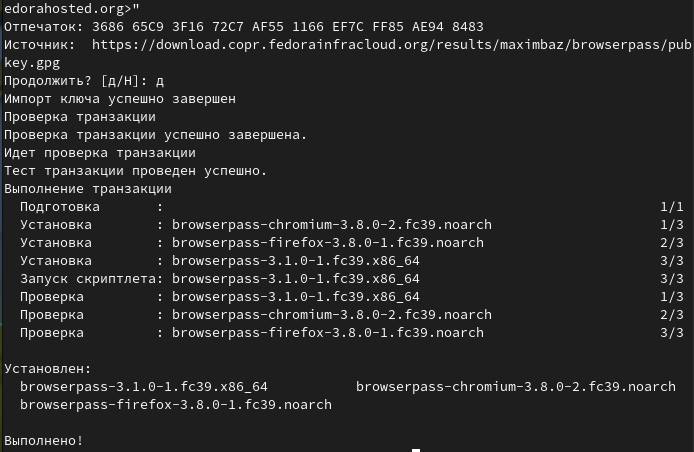{#fig:011 width=80%}

## Настройка интерфейса с броузером

Устанавливаю pass-otp (рис. [-@fig:012]). 

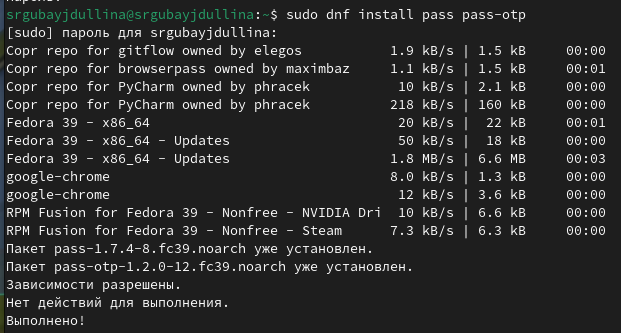{#fig:012 width=80%}

## Настройка интерфейса с броузером

Сохраняю и добавляю новые пароли (рис. [-@fig:013]).

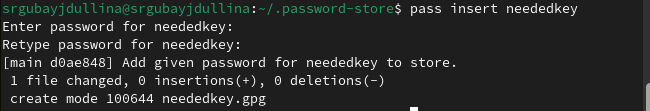{#fig:013 width=80%}

## Настройка интерфейса с броузером

Делаю разблокировку ключа в окне терминала (рис. [-@fig:014]).

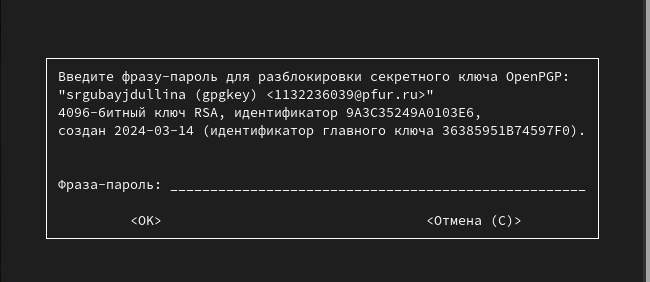{#fig:014 width=80%}

## Настройка интерфейса с броузером

Отображаю пароль для указанного имени файла (рис. [-@fig:015]). 

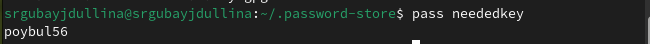{#fig:015 width=80%}

## Настройка интерфейса с броузером

Заменяю существующий пароль (рис. [-@fig:016]).

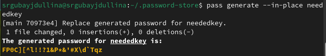{#fig:016 width=80%}

## Управление файлами конфигурации

Устанавливаю дополнительное программное обеспечение (рис. [-@fig:017]).

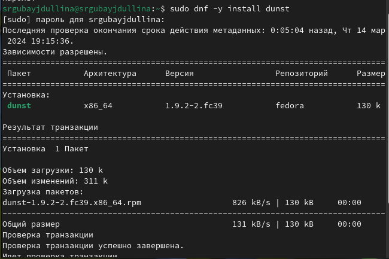{#fig:017 width=80%}

## Управление файлами конфигурации

Устанавливаю дополнительное программное обеспечение (рис. [-@fig:018]).

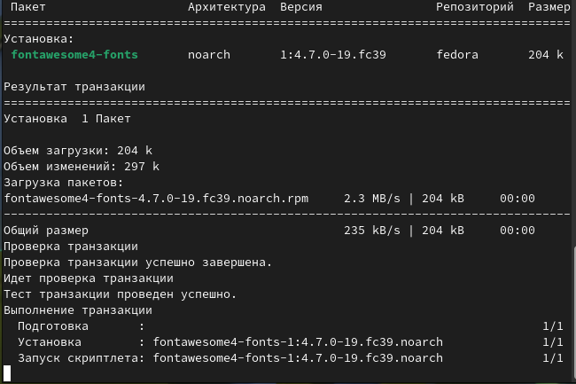{#fig:018 width=80%}

## Управление файлами конфигурации

Устанавливаю дополнительное программное обеспечение (рис. [-@fig:019]).

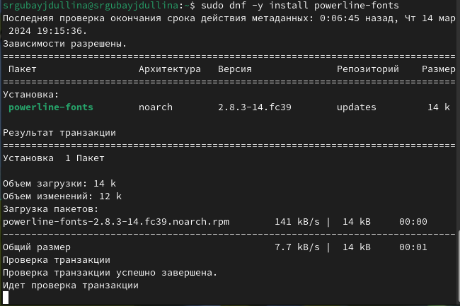{#fig:019 width=80%}

## Управление файлами конфигурации

Устанавливаю дополнительное программное обеспечение (рис. [-@fig:020]).

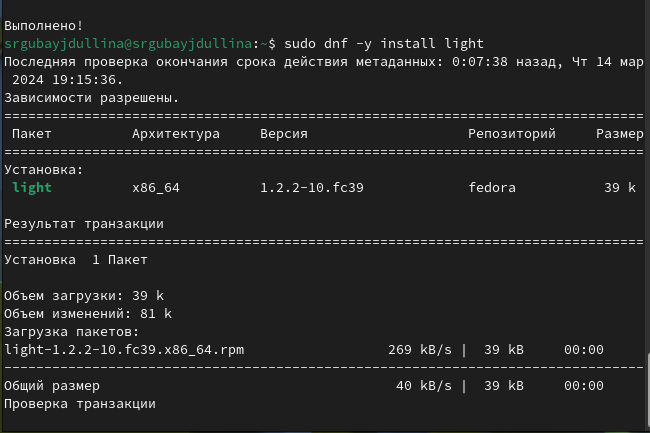{#fig:020 width=80%}

## Управление файлами конфигурации

Устанавливаю дополнительное программное обеспечение (рис. [-@fig:021]).

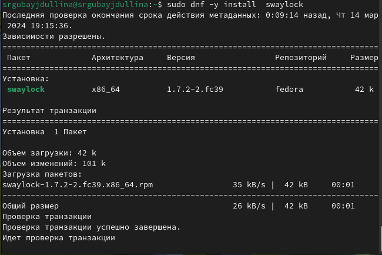{#fig:021 width=80%}

## Управление файлами конфигурации

Устанавливаю дополнительное программное обеспечение (рис. [-@fig:022]).

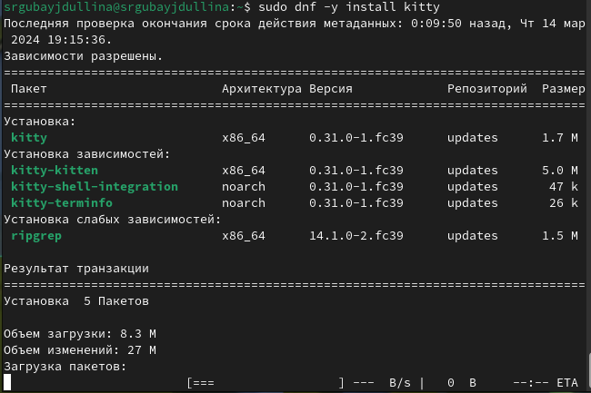{#fig:022 width=80%}

## Управление файлами конфигурации

Устанавливаю дополнительное программное обеспечение (рис. [-@fig:023]).

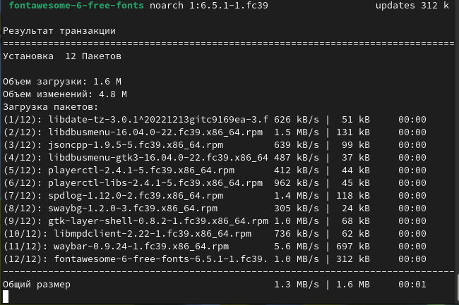{#fig:023 width=80%}

## Управление файлами конфигурации

Устанавливаю дополнительное программное обеспечение (рис. [-@fig:024]).

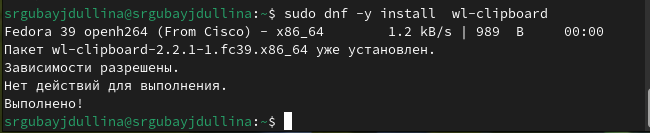{#fig:024 width=80%}

## Управление файлами конфигурации

Устанавливаю дополнительное программное обеспечение (рис. [-@fig:025]).

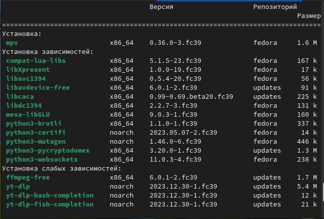{#fig:025 width=80%}

## Управление файлами конфигурации

Устанавливаю дополнительное программное обеспечение (рис. [-@fig:026]).

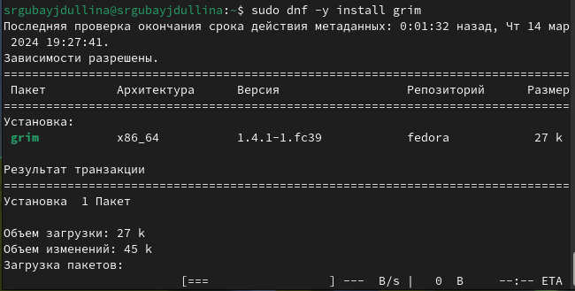{#fig:026 width=80%}

## Управление файлами конфигурации

Устанавливаю дополнительное программное обеспечение (рис. [-@fig:027]).

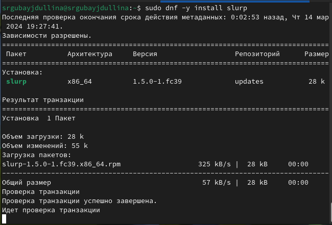{#fig:027 width=80%}

## Управление файлами конфигурации

Устанавливаю необходимые шрифты (рис. [-@fig:028]). 

{#fig:028 width=80%}

## Управление файлами конфигурации

Установка шрифтов (рис. [-@fig:029]).
 
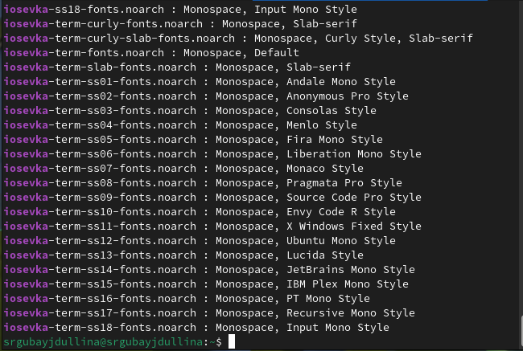{#fig:029 width=80%}

## Создание собственного репозитория с помощью утилит и подключение его к своей системе

Устанавливаю бинарный файл (рис. [-@fig:030]).

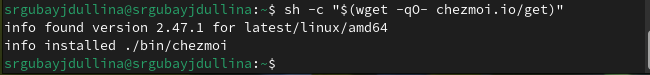{#fig:030 width=80%}

## Создание собственного репозитория с помощью утилит и подключение его к своей системе

Создаю собственный репозиторий с помощью утилит по заданному шаблону (рис. [-@fig:031]).

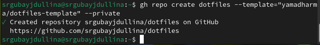{#fig:031 width=80%}

## Создание собственного репозитория с помощью утилит и подключение его к своей системе

Инициализировала chezmoi с репозиторием github, проверила, какие изменения внесёт chezmoi в домашний каталог (рис. [-@fig:031]).

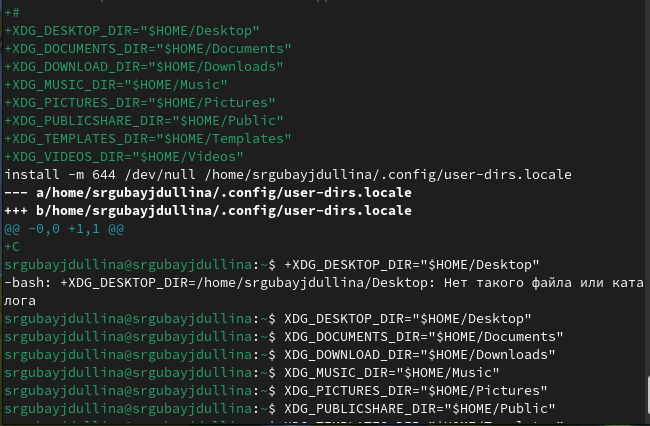{#fig:032 width=80%}

# Результаты

В ходе лабораторной работы я освоила нужные навыки работы с менеджерами паролей pass и навыки пользования chezmoi.

## Итоговый слайд

И у паролей есть свои менеджеры !
