---
## Front matter
title: "Лабораторная работа №5"
subtitle: "Настройка рабочей среды"
author: "Губайдуллина Софья Романовна"

## Generic otions
lang: ru-RU
toc-title: "Содержание"

## Bibliography
bibliography: bib/cite.bib
csl: pandoc/csl/gost-r-7-0-5-2008-numeric.csl

## Pdf output format
toc: true # Table of contents
toc-depth: 2
lof: true # List of figures
lot: true # List of tables
fontsize: 12pt
linestretch: 1.5
papersize: a4
documentclass: scrreprt
## I18n polyglossia
polyglossia-lang:
  name: russian
  options:
   - spelling=modern
   - babelshorthands=true
polyglossia-otherlangs:
  name: english
## I18n babel
babel-lang: russian
babel-otherlangs: english
## Fonts
mainfont: PT Serif
romanfont: PT Serif
sansfont: PT Sans
monofont: PT Mono
mainfontoptions: Ligatures=TeX
romanfontoptions: Ligatures=TeX
sansfontoptions: Ligatures=TeX,Scale=MatchLowercase
monofontoptions: Scale=MatchLowercase,Scale=0.9
## Biblatex
biblatex: true
biblio-style: "gost-numeric"
biblatexoptions:
  - parentracker=true
  - backend=biber
  - hyperref=auto
  - language=auto
  - autolang=other*
  - citestyle=gost-numeric
## Pandoc-crossref LaTeX customization
figureTitle: "Рис."
tableTitle: "Таблица"
listingTitle: "Листинг"
lofTitle: "Список иллюстраций"
lotTitle: "Список таблиц"
lolTitle: "Листинги"
## Misc options
indent: true
header-includes:
  - \usepackage{indentfirst}
  - \usepackage{float} # keep figures where there are in the text
  - \floatplacement{figure}{H} # keep figures where there are in the text
---

# Цель работы

Освоение навыков работы с менеджерами паролей pass и работы с chezmoi.

# Задание

1) Менеджер паролей pass;
2) Настройка интерфейса с броузером;
3) Управление файлами конфигурации;
4) Создание собственного репозитория с помощью утилит и подключение его к своей системе.

# Теоретическое введение

Менеджер паролей pass — программа, сделанная в рамках идеологии Unix.
Также носит название стандартного менеджера паролей для Unix (The standard Unix password manager). Ее данные хранятся в файловой системе в виде каталогов и файлов, файлы же шифруются с помощью GPG-ключа.

Структура базы может быть произвольной, если Вы собираетесь использовать её напрямую, без промежуточного программного обеспечения. Тогда семантику структуры базы данных Вы держите в своей голове.

На данный момент существует 2 основных реализации утилит командной строки - это pass, — классическая реализация в виде shell-скриптов (https://www.passwordstore.org/); а так же gopass — реализация на go с дополнительными интегрированными функциями (https://www.gopass.pw/).

Chezmoi используется для управления файлами конфигурации домашнего каталога пользователя. К примеру при запуске chezmoi apply
вычисляется желаемое содержимое и разрешения для каждого файла, а затем вносит необходимые изменения, чтобы ваши файлы соответствовали этому состоянию, а при выполнении chezmoi init также может автоматически создать файл конфигурации, если он еще не существует.

## Выполнение лабораторной работы

1) При помощи команд в терминале устанавливаем необходимые нам pass и gopass (рис. [-@fig:001]), (рис. [-@fig:002]), (рис. [-@fig:003]).

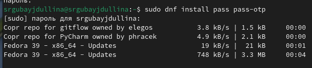{#fig:001 width=80%}

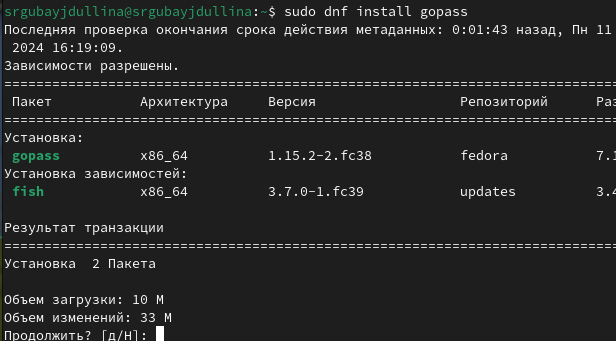{#fig:002 width=80%}

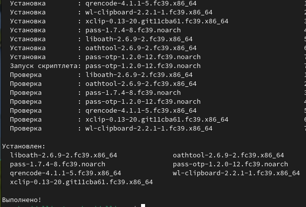{#fig:003 width=80%}

Теперь необходимо проверить наличие PGP-ключей. Их не обнаружилось, потому создаю новый (рис. [-@fig:004]), (рис. [-@fig:005]).

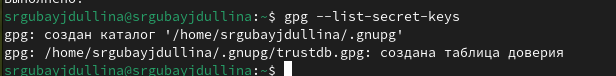{#fig:004 width=80%}

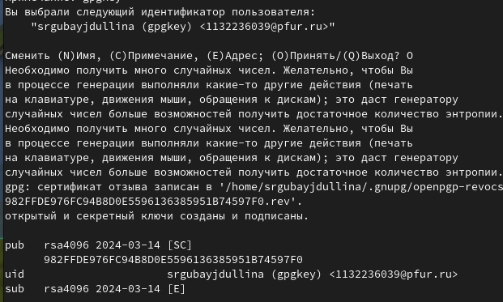{#fig:005 width=80%}

Инициализирую хранилище, после чего создаю структуру git (рис. [-@fig:006]), (рис. [-@fig:007]).

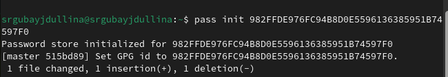{#fig:006 width=80%}

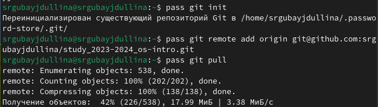{#fig:007 width=80%}

Далее задаю адрес репозитория на хостинге (я создала новый с названием lab5), после чего выполняю команды pass git pull и
pass git push (рис. [-@fig:008]). Так же создаю некоторые прямые изменения, после чего отправляю их на сервер.

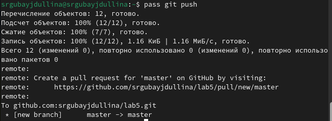{#fig:008 width=80%}

2) Для взаимодействия с броузером используется интерфейс native messaging, поэтому кроме плагина к броузеру будет необходимо установить программу, обеспечивающую интерфейс native messaging (рис. [-@fig:009]).

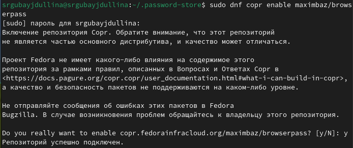{#fig:009 width=80%}

Теперь произвожу установку (рис. [-@fig:010]), (рис. [-@fig:011]).

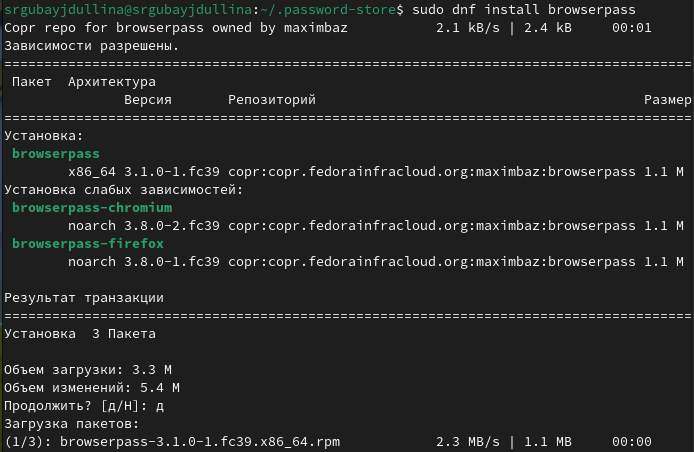{#fig:010 width=80%}

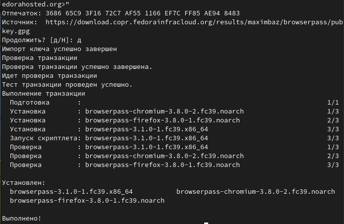{#fig:011 width=80%}

При помощи pass insert и после установки pass-otp (рис. [-@fig:012]), (рис. [-@fig:013]), сохраняю и добавляю новые пароли.

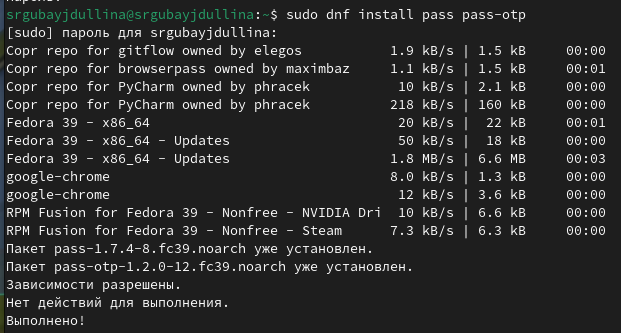{#fig:012 width=80%}

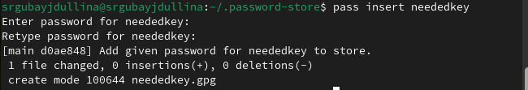{#fig:013 width=80%}

Делаю разблокировку ключа в окне терминала (рис. [-@fig:014]).

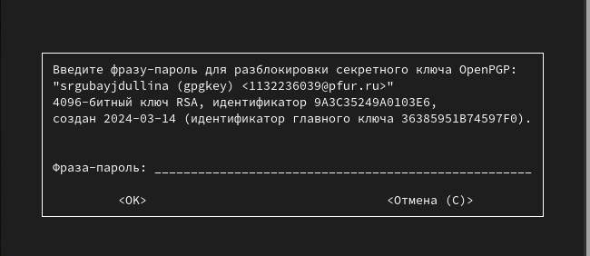{#fig:014 width=80%}

Отображаю пароль для указанного имени файла и заменяю существующий пароль (рис. [-@fig:015]), (рис. [-@fig:016]).

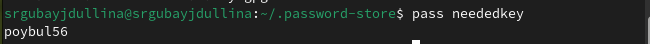{#fig:015 width=80%}

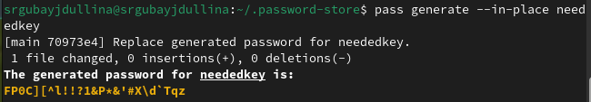{#fig:016 width=80%}

3) Устанавливаю дополнительное программное обеспечение (рис. [-@fig:017]), (рис. [-@fig:018]), (рис. [-@fig:019]), (рис. [-@fig:020]), (рис. [-@fig:021]), (рис. [-@fig:022]), (рис. [-@fig:023]), (рис. [-@fig:024]), (рис. [-@fig:025]), (рис. [-@fig:026]), (рис. [-@fig:027]):

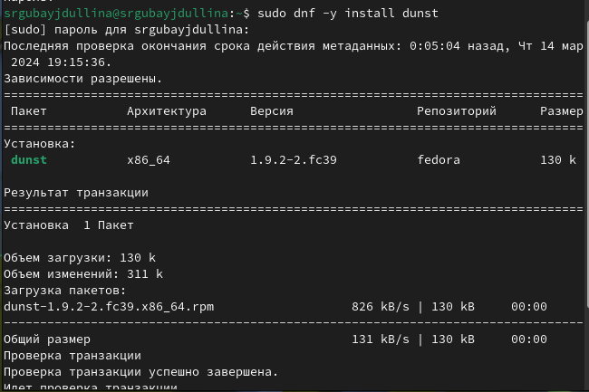{#fig:017 width=80%}

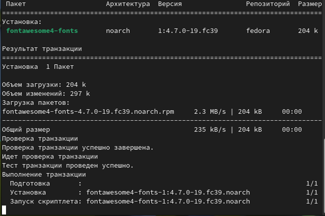{#fig:018 width=80%}

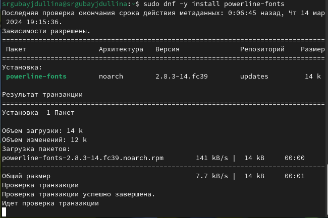{#fig:019 width=80%}

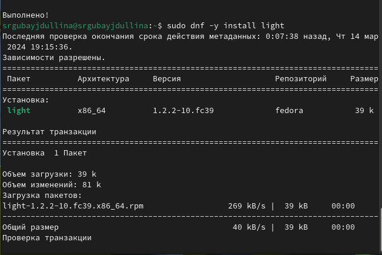{#fig:020 width=80%}

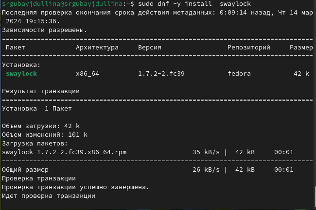{#fig:021 width=80%}

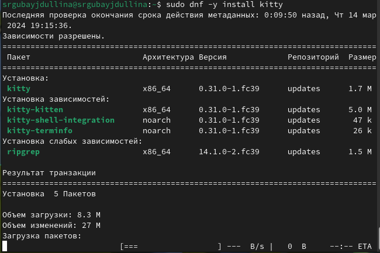{#fig:022 width=80%}

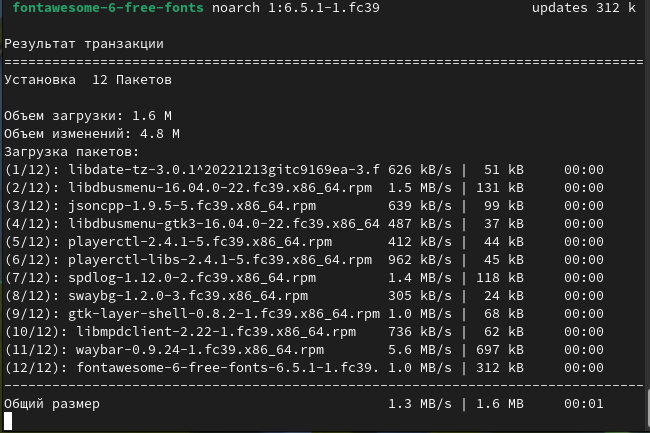{#fig:023 width=80%}

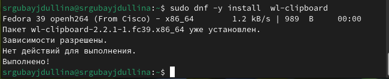{#fig:024 width=80%}

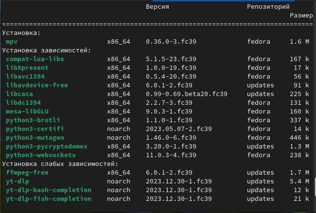{#fig:025 width=80%}

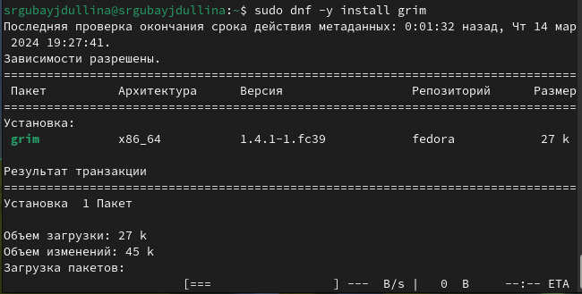{#fig:026 width=80%}

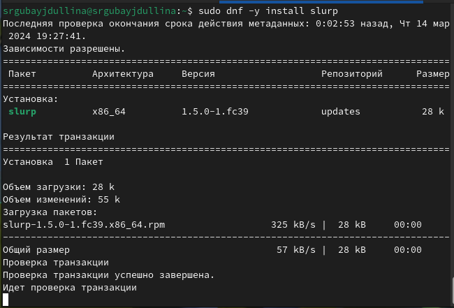{#fig:027 width=80%}

Далее устанавливаю необходимые шрифты (рис. [-@fig:028]), (рис. [-@fig:029]).

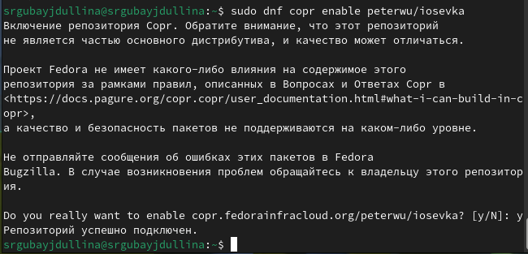{#fig:028 width=80%}

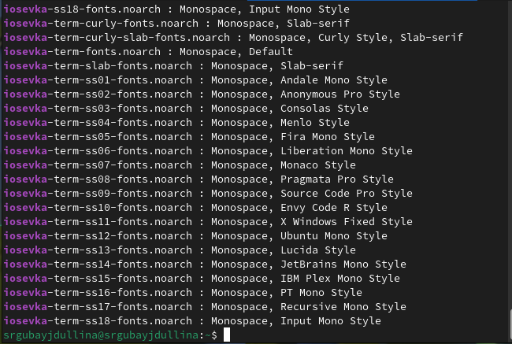{#fig:029 width=80%}

4) Устанавливаю бинарный файл. Скрипт определяет архитектуру процессора и операционную систему и скачивает необходимый файл
с помощью wget (рис. [-@fig:030]):

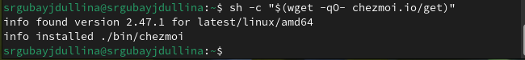{#fig:030 width=80%}

Необходимо также создать собственный репозиторий с помощью утилит по заданному шаблону (рис. [-@fig:031]).

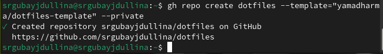{#fig:031 width=80%}

Инициализировала chezmoi с репозиторием github, проверила, какие изменения внесёт chezmoi в домашний каталог (рис. [-@fig:031]).

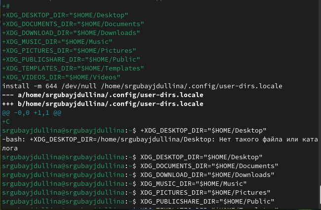{#fig:032 width=80%}

# Выводы

В ходе лабораторной работы я освоила нужные навыки работы с менеджерами паролей pass и навыки пользования chezmoi.

# Список литературы{.unnumbered}

Лабораторная работа №5 (https://esystem.rudn.ru/mod/page/view.php?id=1098796)
