---
## Front matter
lang: ru-RU
title: Лабораторная работа №6
subtitle: Основы интерфейса взаимодействия пользователя с системой Unix на уровне командной строки
author:
  - Губайдуллина Софья Романовна
institute:
  - Российский университет дружбы народов, Москва, Россия
date: 16 марта 2024

## i18n babel
babel-lang: russian
babel-otherlangs: english

## Formatting pdf
toc: false
toc-title: Содержание
slide_level: 2
aspectratio: 169
section-titles: true
theme: metropolis
header-includes:
 - \metroset{progressbar=frametitle,sectionpage=progressbar,numbering=fraction}
 - '\makeatletter'
 - '\beamer@ignorenonframefalse'
 - '\makeatother'
---

## Актуальность

Актуальность лабораторной работы заключается в постоянной работе, а, следовательно, и спросе на работу с системами Unix.

## Объект и предмет исследования

Обьект исследования: система Unix.
Предмет исследования: работа и взаимодействие с Unix через командную строку.

## Цели

Приобретение практических навыков взаимодействия пользователя с системой посредством командной строки.

## Задачи

1) Имя каталога и переход по каталогам;
2) Создание и удаление новых каталогов;
3) Опции команды ls;
4) Команда man для просмотра опций;
5) history.

# Выполнение лабораторной работы

## Имя каталога и переход по каталогам

Команда для вывода полного пути домашнего каталога (рис. [-@fig:001]).

{#fig:001 width=70%}

## Имя каталога и переход по каталогам

С помощью утилиты cd перехожу в каталог /tmp и с ls проверяю его содержимое (рис. [-@fig:002]).

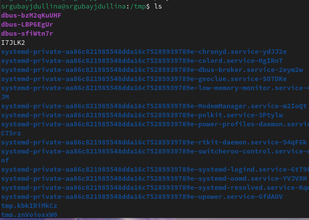{#fig:002 width=70%}

## Имя каталога и переход по каталогам

Приставка утилиты -c с ls выводит файлы, сортируя по времени (рис. [-@fig:003]).

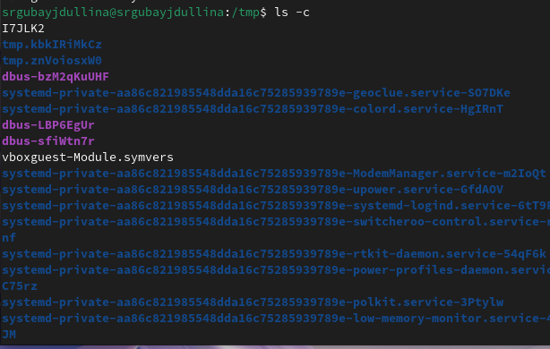{#fig:003 width=70%}

## Имя каталога и переход по каталогам

Ls -C - вывод файлов колонками (рис. [-@fig:004]).

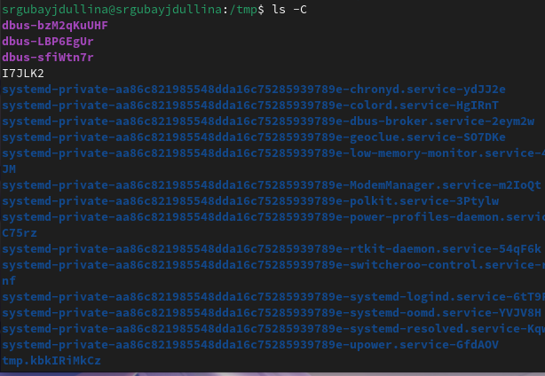{#fig:004 width=70%}

## Имя каталога и переход по каталогам

Применение длинного формата, не показывая информацию о группах (рис. [-@fig:005]).

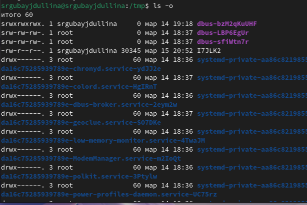{#fig:005 width=70%}

## Имя каталога и переход по каталогам

Выводятся тип файла, права доступа к ним, количество ссылов и т.п. (рис. [-@fig:006]).

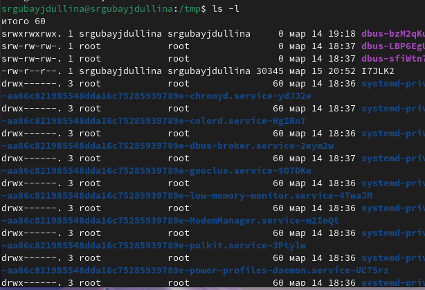{#fig:006 width=70%}

## Имя каталога и переход по каталогам

Перехожу в /var/spool, чтобы посмотреть его содержимое. Нужного файла в нем не оказалось (рис. [-@fig:007]).

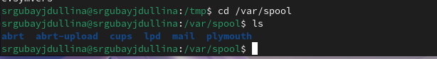{#fig:007 width=70%}

## Имя каталога и переход по каталогам

Перехожу и просматриваю свой домашний каталог (рис. [-@fig:008]).

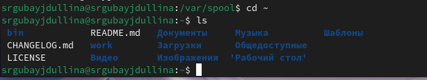{#fig:008 width=70%}

## Имя каталога и переход по каталогам

При помощи утилиты ls -l выясняю владельцев файлов и так же права доступа к ним (рис. [-@fig:009]).

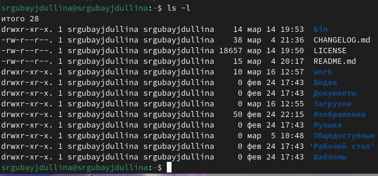{#fig:009 width=70%}

## Создание и удаление новых каталогов

Созданный каталог newdir (рис. [-@fig:010]).

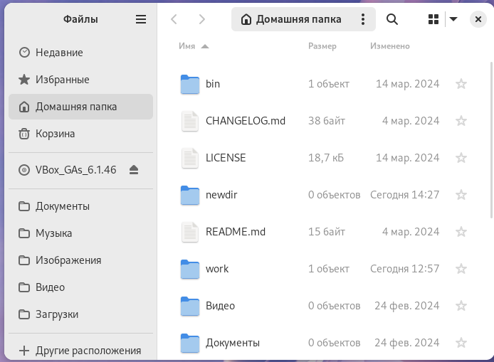{#fig:010 width=70%}

## Создание и удаление новых каталогов

Создаю новый каталог newdir и подкаталог morefun при помощи mkdir (рис. [-@fig:011]).

{#fig:011 width=70%}

## Создание и удаление новых каталогов

Созданный подкаталог morefun(рис. [-@fig:012]).

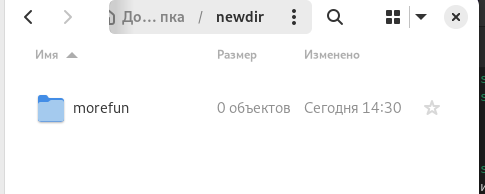{#fig:012 width=70%}

## Создание и удаление новых каталогов

Новые созданные каталоги в домашней директории (рис. [-@fig:013]).

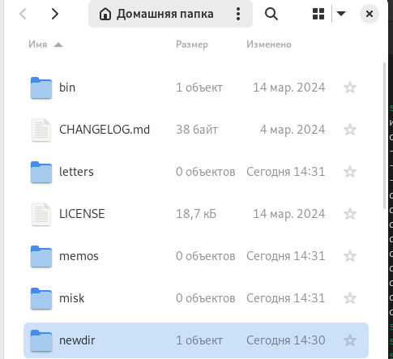{#fig:013 width=70%}

## Создание и удаление новых каталогов

Команда создания новых каталогов letters, memos, misk и их удаление одной командой (рис. [-@fig:014]).

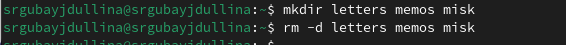{#fig:014 width=70%}

## Создание и удаление новых каталогов

Результат удаления(рис. [-@fig:015]).

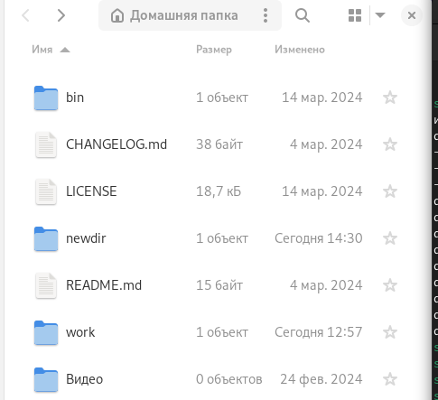{#fig:015 width=70%}

## Создание и удаление новых каталогов

Удаляем newdir и его подкаталог morefun при помощи rm -r (рис. [-@fig:016]).

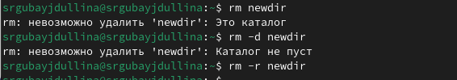{#fig:016 width=70%}

## Создание и удаление новых каталогов

Результат удаления в домашнем каталоге (рис. [-@fig:017]).

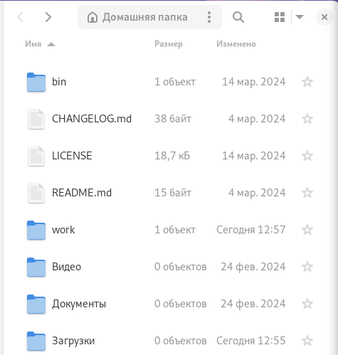{#fig:017 width=70%}

## Опции команды ls

При помощи команды man ls просматриваю опции ls (рис. [-@fig:018]).

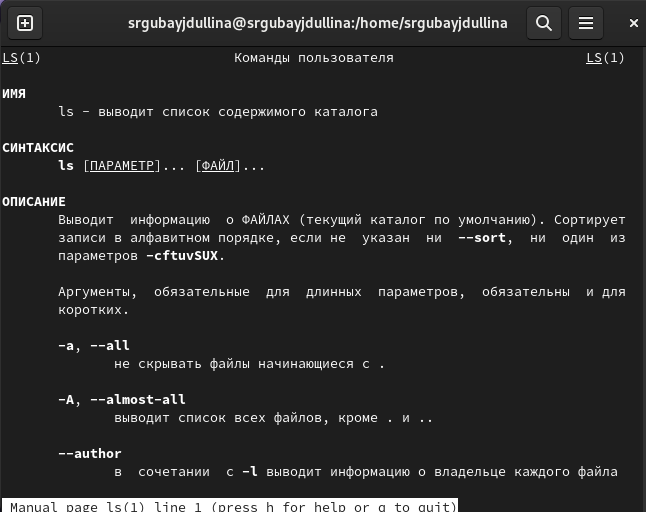{#fig:018 width=70%}

## Опции команды ls

Вывод содержимого каталога и всех его файлов при помощи ls -R (рис. [-@fig:019]).

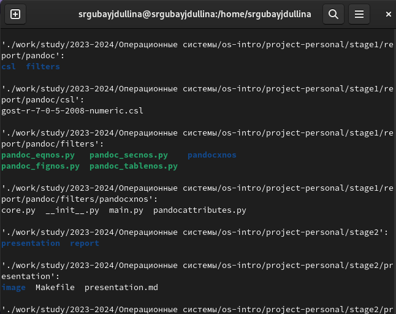{#fig:019 width=70%}

## Опции команды ls

Вывод содержимого всех файлов каталога (рис. [-@fig:020]).

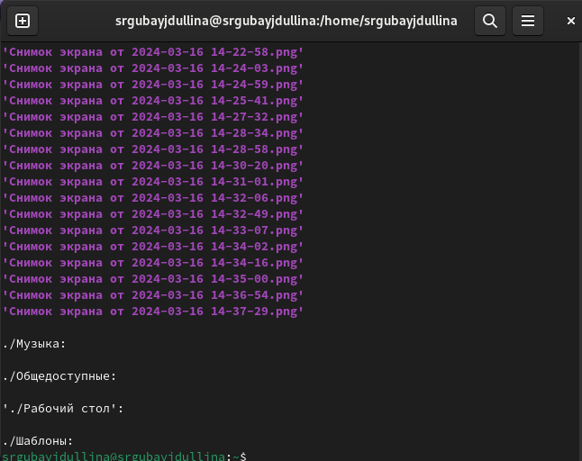{#fig:020 width=70%}

## Опции команды ls

Сортирую файлы домашнего каталога по времени добавления (рис. [-@fig:021]).

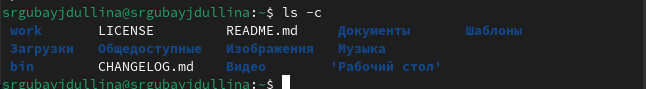{#fig:021 width=70%}

## Команда man для просмотра опций

При помощи man просматриваю опции cd (рис. [-@fig:022]).

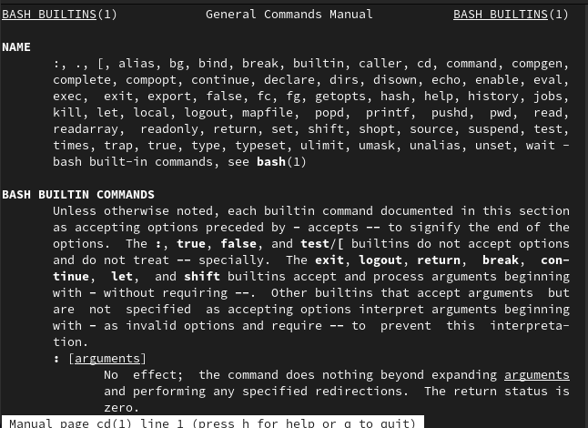{#fig:022 width=70%}

## Команда man для просмотра опций

При помощи man просматриваю опции pwd(рис. [-@fig:023]).

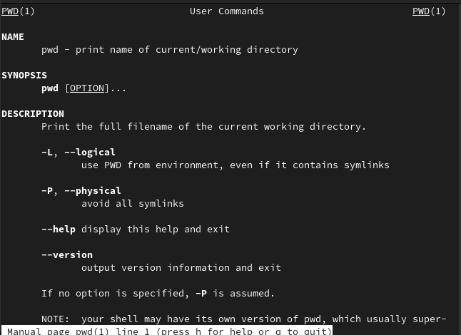{#fig:023 width=70%}

## Команда man для просмотра опций

При помощи man просматриваю опции mkdir (рис. [-@fig:024]).

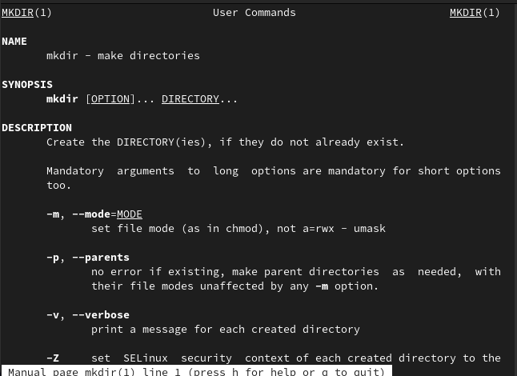{#fig:024 width=70%}

## Команда man для просмотра опций

При помощи man просматриваю опции rmdir (рис. [-@fig:025]).

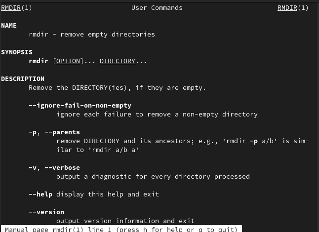{#fig:025 width=70%}

## Команда man для просмотра опций

При помощи man просматриваю опции rm (рис. [-@fig:026]).

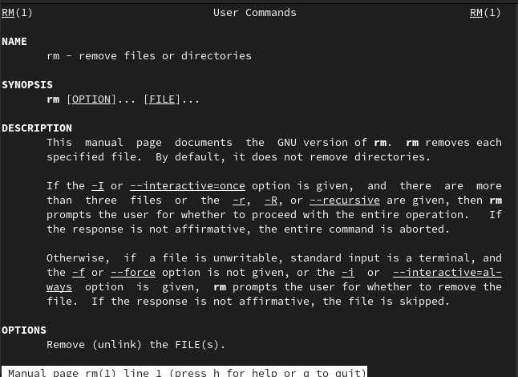{#fig:026 width=70%}

## Команда man для просмотра опций

Все man-команды (рис. [-@fig:027]).

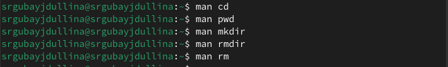{#fig:027 width=70%}

## history

Просматриваю историю всех команд терминала (рис. [-@fig:028]).

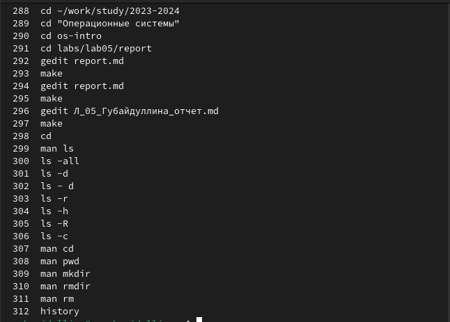{#fig:028 width=70%}

# Результаты

В ходе лабораторной работы я приобрела практические навыки взаимодействия пользователя с системой посредством командной строки.

## Итоговый слайд

Я,мы любим Unix!
