---
## Front matter
title: "Лабораторная работа №6"
subtitle: "Основы интерфейса взаимодействия пользователя с системой Unix на уровне командной строки"
author: "Губайдуллина Софья Романовна"

## Generic otions
lang: ru-RU
toc-title: "Содержание"

## Bibliography
bibliography: bib/cite.bib
csl: pandoc/csl/gost-r-7-0-5-2008-numeric.csl

## Pdf output format
toc: true # Table of contents
toc-depth: 2
lof: true # List of figures
lot: true # List of tables
fontsize: 12pt
linestretch: 1.5
papersize: a4
documentclass: scrreprt
## I18n polyglossia
polyglossia-lang:
  name: russian
  options:
   - spelling=modern
   - babelshorthands=true
polyglossia-otherlangs:
  name: english
## I18n babel
babel-lang: russian
babel-otherlangs: english
## Fonts
mainfont: PT Serif
romanfont: PT Serif
sansfont: PT Sans
monofont: PT Mono
mainfontoptions: Ligatures=TeX
romanfontoptions: Ligatures=TeX
sansfontoptions: Ligatures=TeX,Scale=MatchLowercase
monofontoptions: Scale=MatchLowercase,Scale=0.9
## Biblatex
biblatex: true
biblio-style: "gost-numeric"
biblatexoptions:
  - parentracker=true
  - backend=biber
  - hyperref=auto
  - language=auto
  - autolang=other*
  - citestyle=gost-numeric
## Pandoc-crossref LaTeX customization
figureTitle: "Рис."
tableTitle: "Таблица"
listingTitle: "Листинг"
lofTitle: "Список иллюстраций"
lotTitle: "Список таблиц"
lolTitle: "Листинги"
## Misc options
indent: true
header-includes:
  - \usepackage{indentfirst}
  - \usepackage{float} # keep figures where there are in the text
  - \floatplacement{figure}{H} # keep figures where there are in the text
---

# Цель работы

Приобретение практических навыков взаимодействия пользователя с системой посредством командной строки.

# Задание

1) Имя каталога и переход по каталогам;
2) Создание и удаление новых каталогов;
3) Опции команды ls;
4) Команда man для просмотра опций;
5) history.

# Теоретическое введение

В операционной системе типа Linux взаимодействие пользователя с системой обычно
осуществляется с помощью командной строки посредством построчного ввода команд. При этом обычно используется командные интерпретаторы языка shell: /bin/sh;
/bin/csh; /bin/ksh.

Формат команды. Командой в операционной системе называется записанный по
специальным правилам текст (возможно с аргументами), представляющий собой указание на выполнение какой-либо функций (или действий) в операционной системе.
Обычно первым словом идёт имя команды, остальной текст — аргументы или опции,
конкретизирующие действие.
Общий формат команд можно представить следующим образом:
<имя_команды><разделитель><аргументы>

Команда man используется для просмотра (оперативная помощь) в диалоговом режиме руководства (manual) по основным командам операционной системы
типа Linux.
Формат команды:
man <команда>

Команда cd используется для перемещения по файловой системе операционной системы типа Linux.
Замечание 1. Файловая система ОС типа Linux — иерархическая система каталогов,
подкаталогов и файлов, которые обычно организованы и сгруппированы по функциональному признаку. Самый верхний каталог в иерархии называется корневым
и обозначается символом /. Корневой каталог содержит системные файлы и другие
каталоги.
Формат команды:
cd [путь_к_каталогу]

# Выполнение лабораторной работы

1) Начинаю лабораторную работу с команды для вывода полного пути домашнего каталога (рис. [-@fig:001]).

{#fig:001 width=70%}

С помощью утилиты cd перехожу в каталог /tmp и с ls проверяю его содержимое (рис. [-@fig:002]).

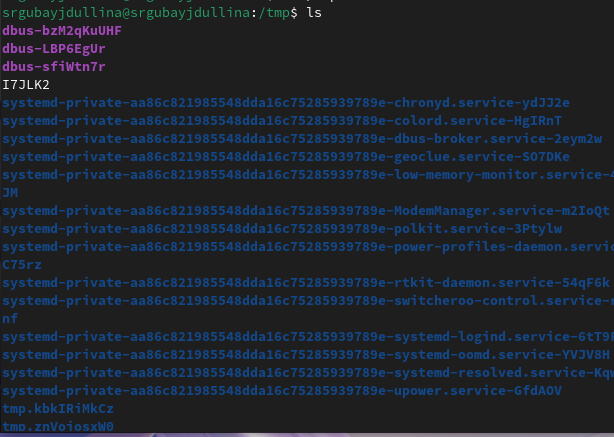{#fig:002 width=70%}

Приставка утилиты -c с ls выводит файлы, сортируя по времени (рис. [-@fig:003]).

{#fig:003 width=70%}

Ls -C - вывод файлов колонками (рис. [-@fig:004]).

{#fig:004 width=70%}

Применение длинного формата, не показывая информацию о группах (рис. [-@fig:005]).

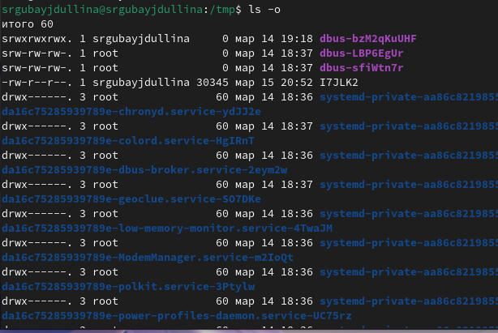{#fig:005 width=70%}

В дополнение к имени каждого выводятся тип файла, права доступа к ним, количество ссылов и т.п. (рис. [-@fig:006]).

{#fig:006 width=70%}

Перехожу в /var/spool, чтобы посмотреть его содержимое. Нужного файла в нем не оказалось (рис. [-@fig:007]).

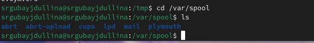{#fig:007 width=70%}

Далее перехожу и просматриваю свой домашний каталог (рис. [-@fig:008]).

{#fig:008 width=70%}

При помощи утилиты ls -l выясняю владельцев файлов и так же права доступа к ним (рис. [-@fig:009]).

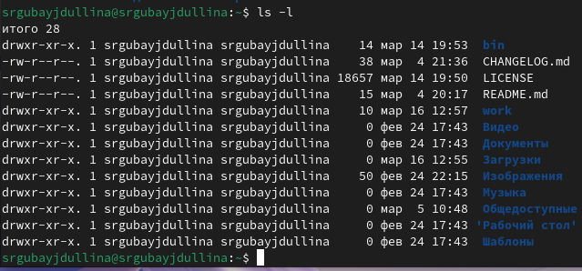{#fig:009 width=70%}

2) Созданный каталог newdir (рис. [-@fig:010]).

{#fig:010 width=70%}

По заданию создаю новый каталог newdir и в нем еще один каталог morefun при помощи mkdir (рис. [-@fig:011]).

{#fig:011 width=70%}

Созданный подкаталог morefun(рис. [-@fig:012]).

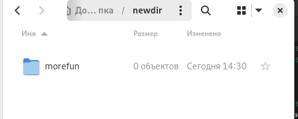{#fig:012 width=70%}

Новые созданные каталоги в домашней директории (рис. [-@fig:013]).

{#fig:013 width=70%}

Команда создания новых каталогов letters, memos, misk и их удаление одной командой (рис. [-@fig:014]).

{#fig:014 width=70%}

Результат удаления(рис. [-@fig:015]).

{#fig:015 width=70%}

Т.к. наш каталог не пуст, удаляем его и его подкаталог morefun при помощи rm -r (рис. [-@fig:016]).

{#fig:016 width=70%}

Результат удаления в домашнем каталоге (рис. [-@fig:017]).

{#fig:017 width=70%}

3) При помощи команды man ls просматриваю опции ls (рис. [-@fig:018]).

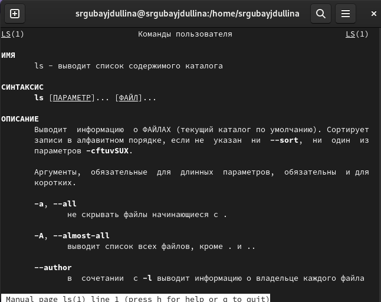{#fig:018 width=70%}

Мне необходима опция ls, которая выводит содержимое каталога и всех его файлов, делаю это при помощи ls -R(рис. [-@fig:019]).

{#fig:019 width=70%}

Вывод содержимого всех файлов каталога (рис. [-@fig:020]).

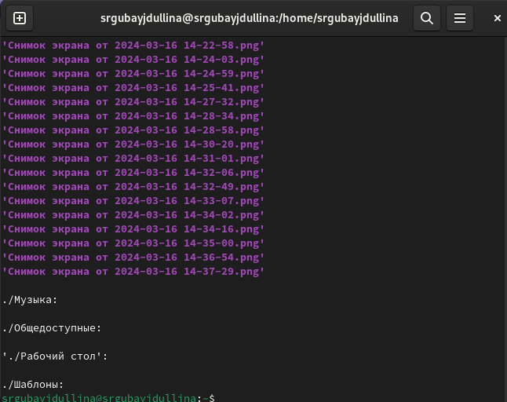{#fig:020 width=70%}

При помощи утилиты ls -c сортирую файлы домашнего каталога по времени добавления (рис. [-@fig:021]).

{#fig:021 width=70%}

4) При помощи man просматриваю опции cd (рис. [-@fig:022]).

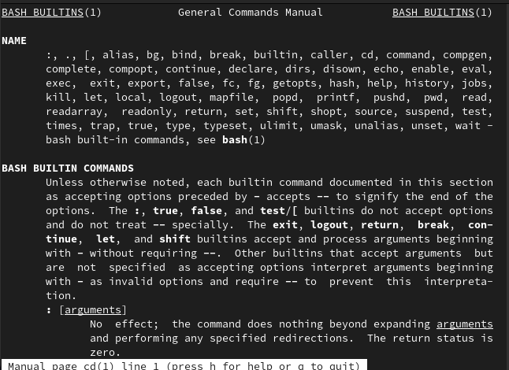{#fig:022 width=70%}

При помощи man просматриваю опции pwd(рис. [-@fig:023]).

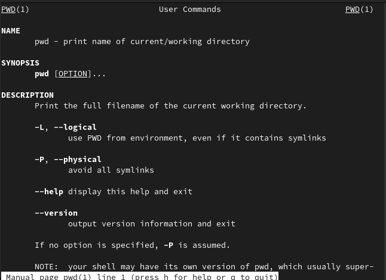{#fig:023 width=70%}

При помощи man просматриваю опции mkdir (рис. [-@fig:024]).

{#fig:024 width=70%}

При помощи man просматриваю опции rmdir (рис. [-@fig:025]).

{#fig:025 width=70%}

При помощи man просматриваю опции rm (рис. [-@fig:026]).

{#fig:026 width=70%}

Все man-команды (рис. [-@fig:027]).

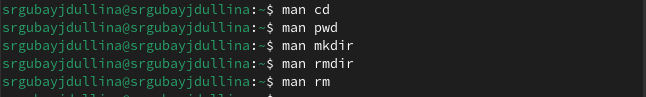{#fig:027 width=70%}

Просматриваю историю всех команд терминала (рис. [-@fig:028]).

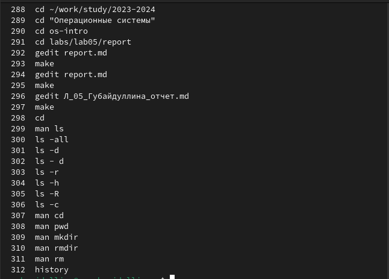{#fig:028 width=70%}

# Выводы

В ходе лабораторной работы я приобрела практические навыки взаимодействия пользователя с системой посредством командной строки.

# Список литературы{.unnumbered}

Лабораторная работа №6 (file:///C:/Users/sguba/pandas/004-lab_shell.pdf)
