---
## Front matter
lang: ru-RU
title: Лабораторная работа №7
subtitle: Анализ файловой системы Linux. Команды для работы с файлами и каталогами
author:
  - Губайдуллина Софья Романовна
institute:
  - Российский университет дружбы народов, Москва, Россия
date: 23 марта 2024

## i18n babel
babel-lang: russian
babel-otherlangs: english

## Formatting pdf
toc: false
toc-title: Содержание
slide_level: 2
aspectratio: 169
section-titles: true
theme: metropolis
header-includes:
 - \metroset{progressbar=frametitle,sectionpage=progressbar,numbering=fraction}
 - '\makeatletter'
 - '\beamer@ignorenonframefalse'
 - '\makeatother'
---

## Цели 

Ознакомление с файловой системой Linux, её структурой, именами и содержанием
каталогов. Приобретение практических навыков по применению команд для работы
с файлами и каталогами, по управлению процессами (и работами), по проверке использования диска и обслуживанию файловой системы.

## Задачи

1) Команды для работы с файлами и каталогами;
2) Копирование файлов и каталогов;
3) Перемещение и переименование файлов и каталогов;
4) Права доступа и их изменения;
5) Анализ файловой системы;
6) Выполнение заданий лабораторной работы.

# Выполнение лабораторной работы

## Команды для работы с файлами и каталогами

Создаю новый файл filename. Вписываю туда текст, с помощью cat вывожу его (рис. [-@fig:001]).

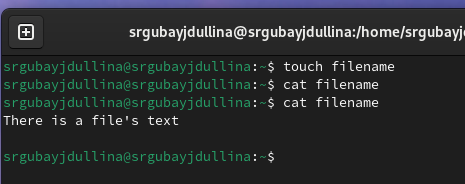{#fig:001 width=70%}

## Команды для работы с файлами и каталогами

Для просмотра файлов постранично удобнее использовать команду less (рис. [-@fig:002]).

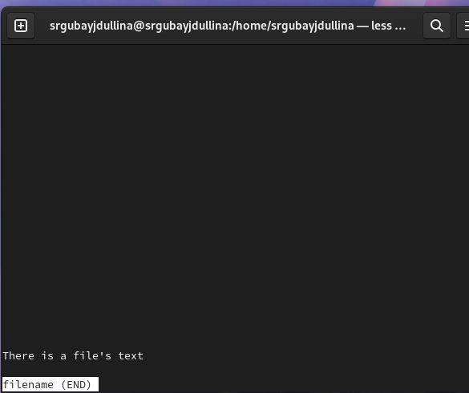{#fig:002 width=70%}

## Команды для работы с файлами и каталогами

При помощи команды head вывожу по умолчанию первые 10 строк файла (рис. [-@fig:003]).

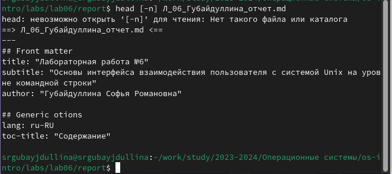{#fig:003 width=70%}

## Команды для работы с файлами и каталогами

Аналогично при помощи команды tail вывожу по умолчанию последние 10 строк файла (рис. [-@fig:004]).

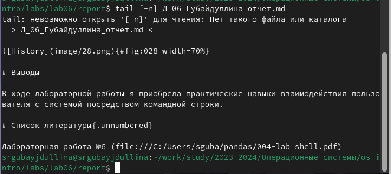{#fig:004 width=70%}

## Копирование файлов и каталогов

Создаю новый file2 и тут же копирую в него содержимое filename (рис. [-@fig:005]).

{#fig:005 width=70%}

## Копирование файлов и каталогов

При помощи утилиты cat проверяю правильность команды (рис. [-@fig:006]).

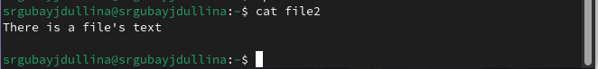{#fig:006 width=70%}

## Копирование файлов и каталогов

Создаю новый каталог mydirectory и копирую в него все вышесозданные файлы (рис. [-@fig:007]).

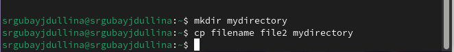{#fig:007 width=70%}

## Копирование файлов и каталогов

Проверяю mydirectory на наличие файлов (рис. [-@fig:008]).

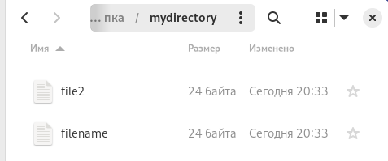{#fig:008 width=70%}

## Копирование файлов и каталогов

Создаю каталог monthly.00 и добавляю в него старый каталог mydirectory (рис. [-@fig:009]).

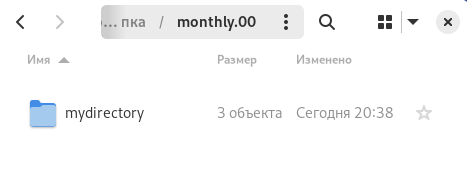{#fig:009 width=70%}

## Копирование файлов и каталогов

Копирую каталог monthly.00 в /tmp и проверяю содержимое последнего (рис. [-@fig:010]).

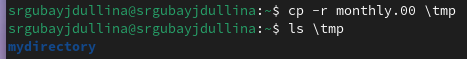{#fig:010 width=70%}

## Перемещение и переименование файлов и каталогов

 Создаю новый файл april (рис. [-@fig:011]).

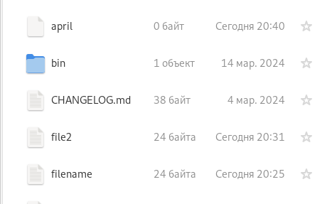{#fig:011 width=70%}

## Перемещение и переименование файлов и каталогов

Переименовываю april в july (рис. [-@fig:012]).

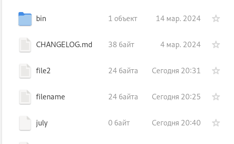{#fig:012 width=70%}

## Перемещение и переименование файлов и каталогов

Перемещаю july в каталог monthly.00 (рис. [-@fig:013]).

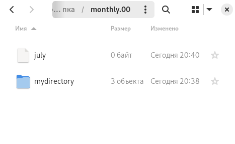{#fig:013 width=70%}

## Перемещение и переименование файлов и каталогов

Переименовываю monthly.00 и перемещаю в monthly.01 (рис. [-@fig:014]).

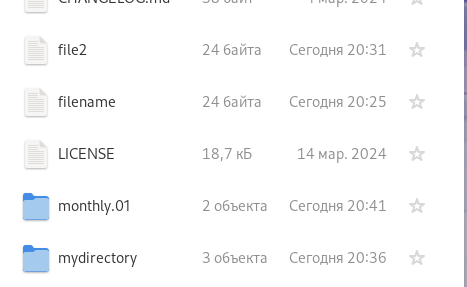{#fig:014 width=70%}

## Перемещение и переименование файлов и каталогов

Команды в терминале по перемещению и переименованию каталога (рис. [-@fig:015]).

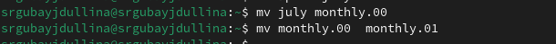{#fig:015 width=70%}

## Перемещение и переименование файлов и каталогов

Перемещаю каталог monthly.01 в новый reports и проверяю содержимое последнего (рис. [-@fig:016]).

{#fig:016 width=70%}

## Перемещение и переименование файлов и каталогов

Команды перемещения в терминале (рис. [-@fig:017]).

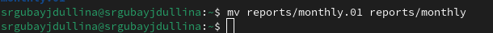{#fig:017 width=70%}

## Перемещение и переименование файлов и каталогов

Проверка содержимого reports (рис. [-@fig:018]).

{#fig:018 width=70%}

## Права доступа и их изменения

Создаю файл may, после чего проверяю его права. Далее лишаю право владельца на владение (рис. [-@fig:019]).

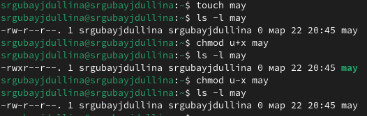{#fig:019 width=70%}

## Права доступа и их изменения

Создаю новый каталог monthly и изменяю права доступа в нем (рис. [-@fig:020]).

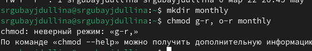{#fig:020 width=70%}

## Права доступа и их изменения

Создаю новый файл abc1 и так же изменяю его права, после чего смотрю на полученные изменения (рис. [-@fig:021]).

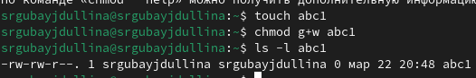{#fig:021 width=70%}

## Анализ файловой системы

Использую утилиту mount, чтобы анализировать свою файловую систему (рис. [-@fig:022]).

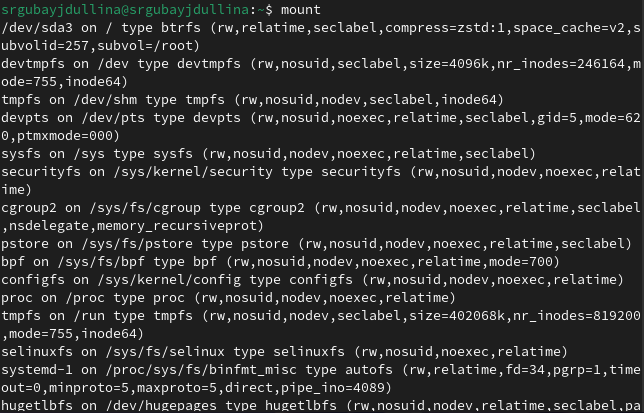{#fig:022 width=70%}

## Анализ файловой системы

Далее проверяю содержимое /etc/fstab (рис. [-@fig:023]).

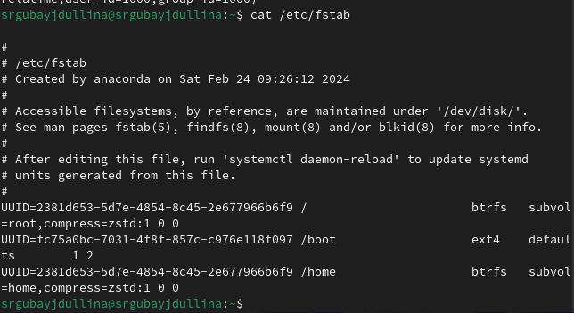{#fig:023 width=70%}

## Анализ файловой системы

Воспользуюсь командой df, для вывода всех файловых систем (рис. [-@fig:024]).

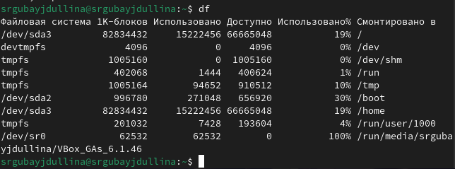{#fig:024 width=70%}

## Анализ файловой системы

С помощью команды fsck проверяю целостность файловой системы (рис. [-@fig:025]):

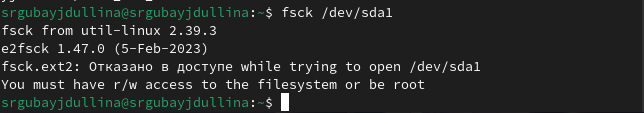{#fig:025 width=70%}

## Выполнение заданий лабораторной работы

Создаю новый файл io.h (рис. [-@fig:026]).

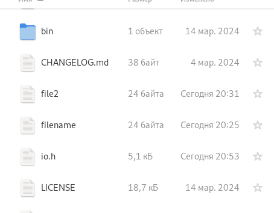{#fig:026 width=70%}

## Выполнение заданий лабораторной работы

Далее переименую его в equipment (рис. [-@fig:027]).

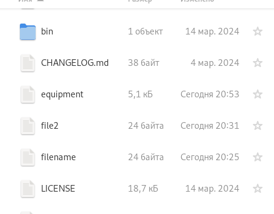{#fig:027 width=70%}

## Выполнение заданий лабораторной работы

Создаю новый каталог ski.places (рис. [-@fig:028]).

{#fig:028 width=70%}

## Выполнение заданий лабораторной работы

Перемещаю созданный ранее файл equipment в новый каталог ski.places и проверяю содержимое последнего (рис. [-@fig:029]).

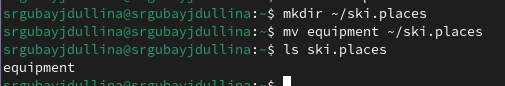{#fig:029 width=70%}

## Выполнение заданий лабораторной работы

Переименовываю equipment на equiplist (рис. [-@fig:030]).

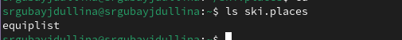{#fig:030 width=70%}

## Выполнение заданий лабораторной работы

Создаю новый файл, тут же копирую его в каталог ski.places и проверяю содержимое каталога (рис. [-@fig:031]).

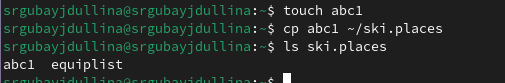{#fig:031 width=70%}

## Выполнение заданий лабораторной работы

Переименую новый файл каталога в equiplist2 (рис. [-@fig:032]).

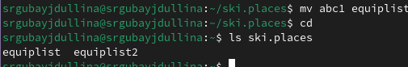{#fig:032 width=70%}

## Выполнение заданий лабораторной работы

Создаю новый каталог equipment и перемещаю его в ski.places (рис. [-@fig:033]).

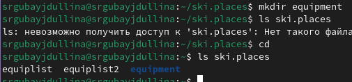{#fig:033 width=70%}

## Выполнение заданий лабораторной работы

Все ранее созданные файлы каталога ski.places перемещаю в новый equipment (рис. [-@fig:034]).

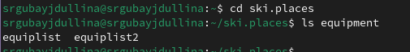{#fig:034 width=70%}

## Выполнение заданий лабораторной работы

Команды перемещения файлов (рис. [-@fig:035]).

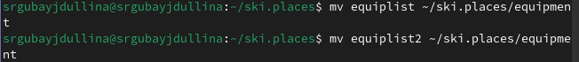{#fig:035 width=70%}

## Выполнение заданий лабораторной работы

Создам новый каталог newdir, перемещу его в ski.places, после чего проверю правильность операций (рис. [-@fig:036]).

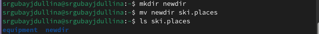{#fig:036 width=70%}

## Выполнение заданий лабораторной работы

Переименовываю newdir в каталог plans (рис. [-@fig:037]).

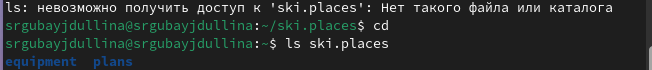{#fig:037 width=70%}

## Выполнение заданий лабораторной работы

После создания нового файла australia, я меняю права доступа файла, после чего проверяю изменения (рис. [-@fig:038]).

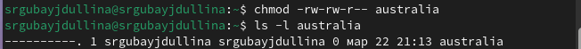{#fig:038 width=70%}

## Выполнение заданий лабораторной работы

Проделываю аналогичное с файлов my_os (рис. [-@fig:039]).

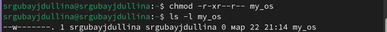{#fig:039 width=70%}

## Выполнение заданий лабораторной работы

Создаю новый fail.old по зданию, тут же копирую в него содержимое feathers. Создаю новый каталог play для последующих операций над ним (рис. [-@fig:040]).

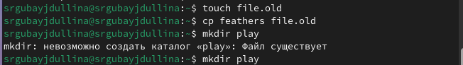{#fig:040 width=70%}

## Выполнение заданий лабораторной работы

Перемещаю файл file.old в каталог play и проверяю его содержимое (рис. [-@fig:041]).

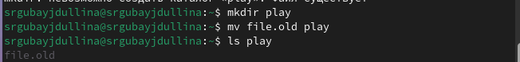{#fig:041 width=70%}

## Выполнение заданий лабораторной работы

Создаю каталог fun и перемещаю play в негою Проверяю (рис. [-@fig:042]).

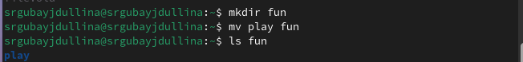{#fig:042 width=70%}

## Выполнение заданий лабораторной работы

Переименовываю play в games (рис. [-@fig:043]).

{#fig:043 width=70%}

## Выполнение заданий лабораторной работы

Лишаю владельца прав на чтение файла feathers (рис. [-@fig:044]).

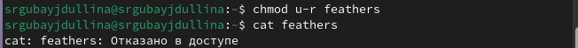{#fig:044 width=70%}

## Выполнение заданий лабораторной работы

Копирую содержимое feathers в my_os (рис. [-@fig:045]).

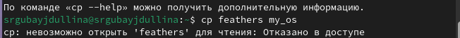{#fig:045 width=70%}

## Выполнение заданий лабораторной работы

Лишаю прав доступа владельца на выполнение действий в каталоге play (рис. [-@fig:046]).

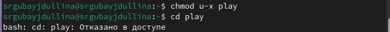{#fig:046 width=70%}

## Выполнение заданий лабораторной работы

Восстанавливаю права на действия в каталоге play (рис. [-@fig:047]).

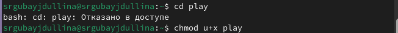{#fig:047 width=70%}

## Выполнение заданий лабораторной работы

Далее по заданию проверяю команды при помощи утилиты man (рис. [-@fig:048]).

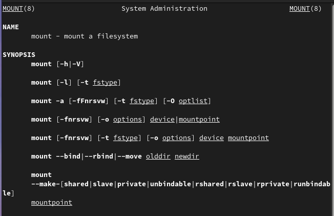{#fig:048 width=70%}

## Выполнение заданий лабораторной работы

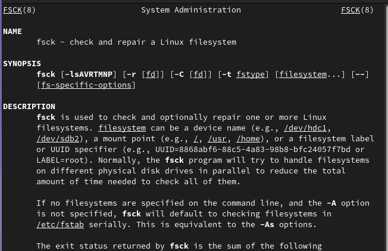{#fig:049 width=70%}

## Выполнение заданий лабораторной работы

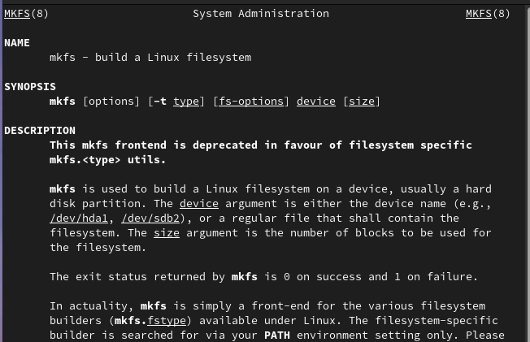{#fig:050 width=70%}

## Выполнение заданий лабораторной работы

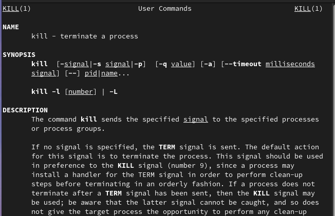{#fig:051 width=70%}

## Результаты

В ходе лабораторной работы я ознакомилась с файловой системой Linux, её структурой, именами и содержанием
каталогов. Приобрела практических навыков по применению команд для работы
с файлами и каталогами, по управлению процессами (и работами), по проверке использования диска и обслуживанию файловой системы.

## Итоговый слайд

Такая вот она - родословная система файлов Linux!
