---
## Front matter
title: "Лабораторная работа №7"
subtitle: "Анализ файловой системы Linux. Команды для работы с файлами и каталогами"
author: "Губайдуллина Софья Романовна"

## Generic otions
lang: ru-RU
toc-title: "Содержание"

## Bibliography
bibliography: bib/cite.bib
csl: pandoc/csl/gost-r-7-0-5-2008-numeric.csl

## Pdf output format
toc: true # Table of contents
toc-depth: 2
lof: true # List of figures
lot: true # List of tables
fontsize: 12pt
linestretch: 1.5
papersize: a4
documentclass: scrreprt
## I18n polyglossia
polyglossia-lang:
  name: russian
  options:
   - spelling=modern
   - babelshorthands=true
polyglossia-otherlangs:
  name: english
## I18n babel
babel-lang: russian
babel-otherlangs: english
## Fonts
mainfont: PT Serif
romanfont: PT Serif
sansfont: PT Sans
monofont: PT Mono
mainfontoptions: Ligatures=TeX
romanfontoptions: Ligatures=TeX
sansfontoptions: Ligatures=TeX,Scale=MatchLowercase
monofontoptions: Scale=MatchLowercase,Scale=0.9
## Biblatex
biblatex: true
biblio-style: "gost-numeric"
biblatexoptions:
  - parentracker=true
  - backend=biber
  - hyperref=auto
  - language=auto
  - autolang=other*
  - citestyle=gost-numeric
## Pandoc-crossref LaTeX customization
figureTitle: "Рис."
tableTitle: "Таблица"
listingTitle: "Листинг"
lofTitle: "Список иллюстраций"
lotTitle: "Список таблиц"
lolTitle: "Листинги"
## Misc options
indent: true
header-includes:
  - \usepackage{indentfirst}
  - \usepackage{float} # keep figures where there are in the text
  - \floatplacement{figure}{H} # keep figures where there are in the text
---

# Цель работы

Ознакомление с файловой системой Linux, её структурой, именами и содержанием
каталогов. Приобретение практических навыков по применению команд для работы
с файлами и каталогами, по управлению процессами (и работами), по проверке использования диска и обслуживанию файловой системы.

# Задание

1) Команды для работы с файлами и каталогами;
2) Копирование файлов и каталогов;
3) Перемещение и переименование файлов и каталогов;
4) Права доступа и их изменения;
5) Анализ файловой системы;
6) Выполнение заданий лабораторной работы.

# Теоретическое введение

1. Команды для работы с файлами и каталогами
Для создания текстового файла можно использовать команду touch.
Формат команды:
- touch имя-файла
Для просмотра файлов небольшого размера можно использовать команду cat.
Формат команды:
- cat имя-файла
Для просмотра файлов постранично удобнее использовать команду less.
Формат команды:
- less имя-файла

2. Команда cp используется для копирования файлов и каталогов.
Формат команды:
- cp [-опции] исходный_файл целевой_файл

3. Команды mv и mvdir предназначены для перемещения и переименования файлов
и каталогов.
Формат команды mv:
- mv [-опции] старый_файл новый_файл

4. Каждый файл или каталог имеет права доступа.
В сведениях о файле или каталоге указываются:
– тип файла (символ (-) обозначает файл, а символ (d) — каталог);
– права для владельца файла (r — разрешено чтение, w — разрешена запись, x — разрешено выполнение, - — право доступа отсутствует);
– права для членов группы (r — разрешено чтение, w — разрешена запись, x — разрешено
выполнение, - — право доступа отсутствует);
– права для всех остальных (r — разрешено чтение, w — разрешена запись, x — разрешено
выполнение, - — право доступа отсутствует).

5. Права доступа к файлу или каталогу можно изменить, воспользовавшись командой
chmod. Сделать это может владелец файла (или каталога) или пользователь с правами
администратора.
Формат команды:
- chmod режим имя_файла
Режим (в формате команды) имеет следующие компоненты структуры и способ записи:
= установить право
- лишить права
+ дать право
r чтение
w запись
x выполнение
u (user) владелец файла
g (group) группа, к которой принадлежит владелец файла
o (others) все остальные.

# Выполнение лабораторной работы

1) Начинаю лабораторную работу с создания нового файла filename. Впишу туда текст и  с помощью cat вывожу его (рис. [-@fig:001]).

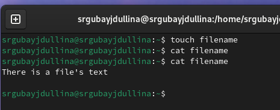{#fig:001 width=70%}

Для просмотра файлов постранично удобнее использовать команду less (рис. [-@fig:002]).

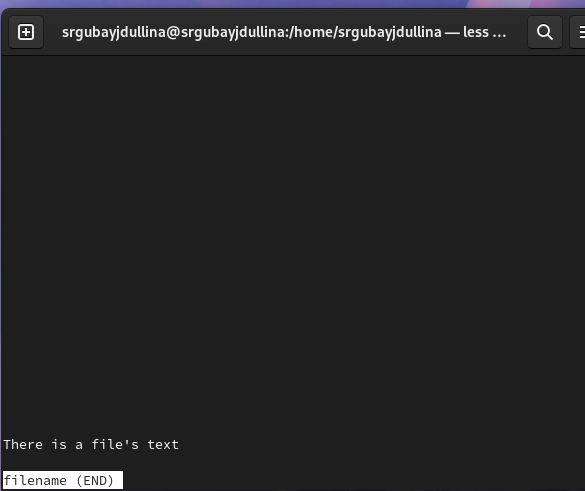{#fig:002 width=70%}

При помощи команды head вывожу по умолчанию первые 10 строк файла (рис. [-@fig:003]).

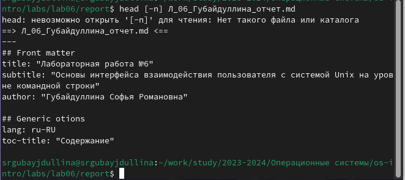{#fig:003 width=70%}

Аналогично при помощи команды tail вывожу по умолчанию последние 10 строк файла (рис. [-@fig:004]).

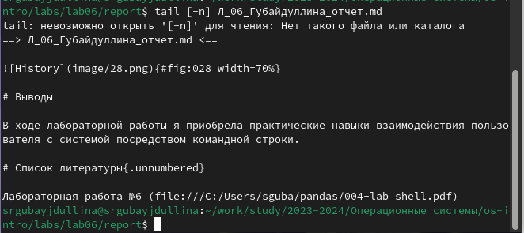{#fig:004 width=70%}

2) Создаю новый file2 и тут же копирую в него содержимое filename (рис. [-@fig:005]).

{#fig:005 width=70%}

При помощи утилиты cat проверяю правильность команды (рис. [-@fig:006]).

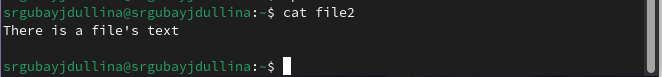{#fig:006 width=70%}

Создаю новый каталог mydirectory и копирую в него все вышесозданные файлы (рис. [-@fig:007]).

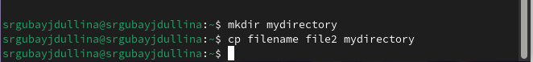{#fig:007 width=70%}

Проверяю mydirectory на наличие файлов (рис. [-@fig:008]).

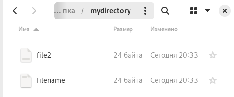{#fig:008 width=70%}

Создаю каталог monthly.00 и добавляю в него старый каталог mydirectory (рис. [-@fig:009]).

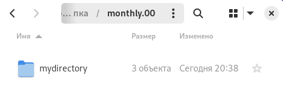{#fig:009 width=70%}

Копирую каталог monthly.00 в /tmp и проверяю содержимое последнего (рис. [-@fig:010]).

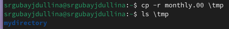{#fig:010 width=70%}

3) Создаю новый файл april (рис. [-@fig:011]).

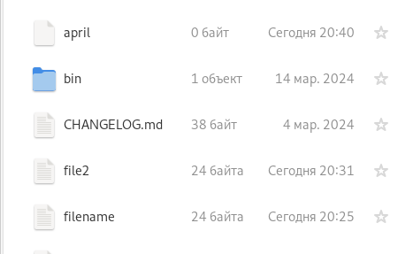{#fig:011 width=70%}

Переименовываю april в july (рис. [-@fig:012]).

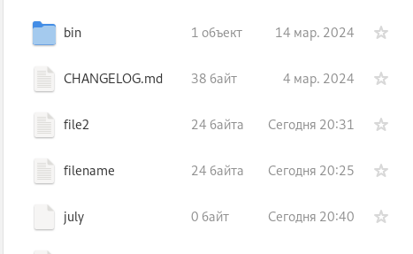{#fig:012 width=70%}

Перемещаю july в каталог monthly.00 (рис. [-@fig:013]).

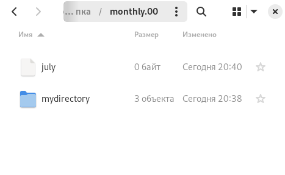{#fig:013 width=70%}

Переименовываю monthly.00 и перемещаю в monthly.01 (рис. [-@fig:014]).

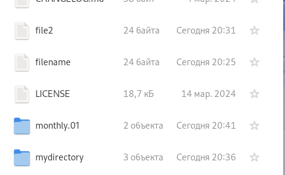{#fig:014 width=70%}

Команды в терминале по перемещению и переименованию каталога (рис. [-@fig:015]).

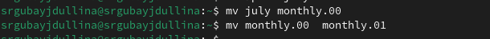{#fig:015 width=70%}

Перемещаю каталог monthly.01 в новый reports и проверяю содержимое последнего (рис. [-@fig:016]).

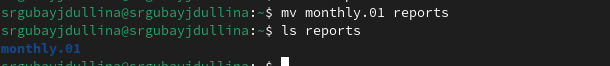{#fig:016 width=70%}

Команды перемещения в терминале (рис. [-@fig:017]).

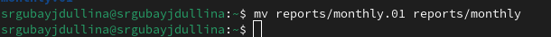{#fig:017 width=70%}

Проверка содержимого reports (рис. [-@fig:018]).

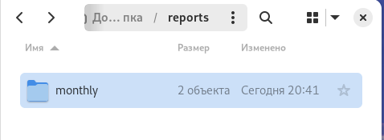{#fig:018 width=70%}

4) Создаю файл may, после чего проверяю его права. Далее лишаю право владельца на владение (рис. [-@fig:019]).

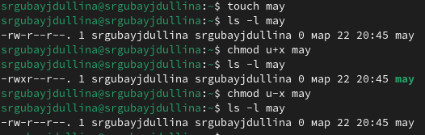{#fig:019 width=70%}

Создаю новый каталог monthly и изменяю права доступа в нем (рис. [-@fig:020]).

{#fig:020 width=70%}

Создаю новый файл abc1 и так же изменяю его права, после чего смотрю на полученные изменения (рис. [-@fig:021]).

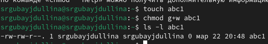{#fig:021 width=70%}

5) Использую утилиту mount, чтобы анализировать свою файловую систему (рис. [-@fig:022]).

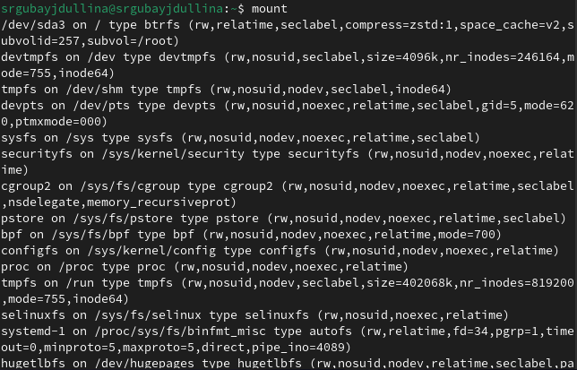{#fig:022 width=70%}

Далее проверяю содержимое /etc/fstab (рис. [-@fig:023]).

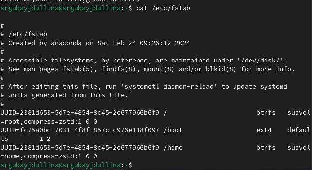{#fig:023 width=70%}

Для определения объёма свободного пространства на файловой системе воспользуюсь командой df, которая выведет на экран список всех файловых систем в соответствии с именами устройств, с указанием размера и точки монтирования (рис. [-@fig:024]).

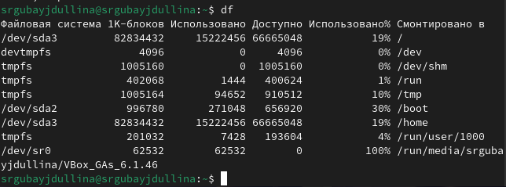{#fig:024 width=70%}

С помощью команды fsck проверяю целостность файловой системы (рис. [-@fig:025]):

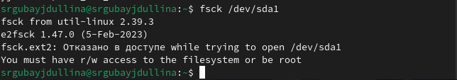{#fig:025 width=70%}

6) Начинаю выполнение самостоятельной работы. Для этого создаю новый файл io.h (рис. [-@fig:026]).

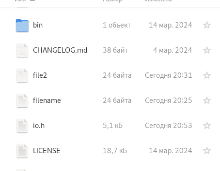{#fig:026 width=70%}

Далее переименую его в equipment (рис. [-@fig:027]).

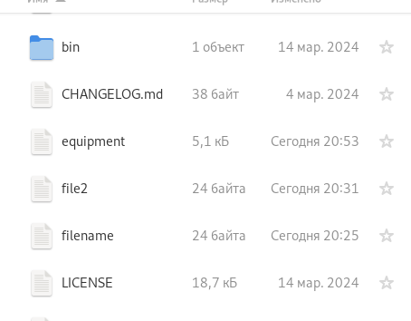{#fig:027 width=70%}

Создаю новый каталог ski.places (рис. [-@fig:028]).

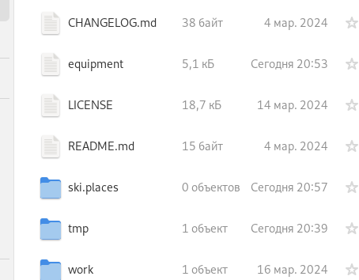{#fig:028 width=70%}

Перемещаю созданный ранее файл equipment в новый каталог ski.places и проверяю содержимое последнего (рис. [-@fig:029]).

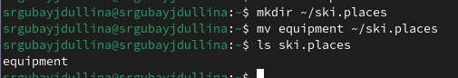{#fig:029 width=70%}

Переименовываю equipment на equiplist (рис. [-@fig:030]).

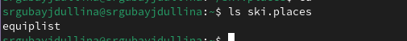{#fig:030 width=70%}

Создаю новый файл, тут же копирую его в каталог ski.places и проверяю содержимое каталога (рис. [-@fig:031]).

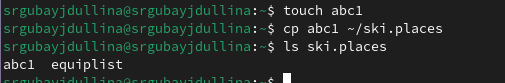{#fig:031 width=70%}

Переименую новый файл каталога в equiplist2 (рис. [-@fig:032]).

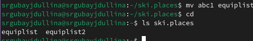{#fig:032 width=70%}

Создаю новый каталог equipment и перемещаю его в ski.places (рис. [-@fig:033]).

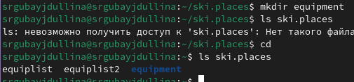{#fig:033 width=70%}

Все ранее созданные файлы каталога ski.places перемещаю в новый equipment (рис. [-@fig:034]).

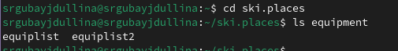{#fig:034 width=70%}

Команды перемещения файлов (рис. [-@fig:035]).

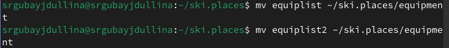{#fig:035 width=70%}

Создам новый каталог newdir, перемещу его в ski.places, после чего проверю правильность операций (рис. [-@fig:036]).

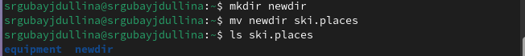{#fig:036 width=70%}

Переименовываю newdir в каталог plans (рис. [-@fig:037]).

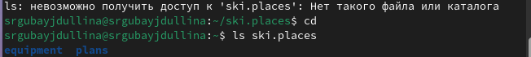{#fig:037 width=70%}

После создания нового файла australia, я меняю права доступа файла, после чего проверяю изменения (рис. [-@fig:038]).

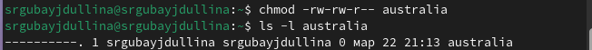{#fig:038 width=70%}

Проделываю аналогичное с файлов my_os (рис. [-@fig:039]).

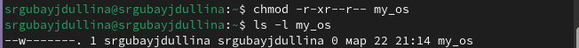{#fig:039 width=70%}

Создаю новый fail.old по зданию, тут же копирую в него содержимое feathers. Создаю новый каталог play для последующих операций над ним (рис. [-@fig:040]).

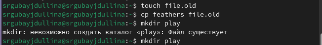{#fig:040 width=70%}

Перемещаю файл file.old в каталог play и проверяю его содержимое (рис. [-@fig:041]).

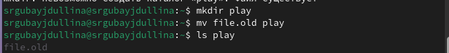{#fig:041 width=70%}

Создаю каталог fun и перемещаю play в негою Проверяю (рис. [-@fig:042]).

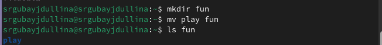{#fig:042 width=70%}

Переименовываю play в games (рис. [-@fig:043]).

{#fig:043 width=70%}

Лишаю владельца прав на чтение файла feathers (рис. [-@fig:044]).

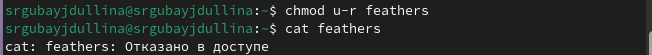{#fig:044 width=70%}

Копирую содержимое feathers в my_os (рис. [-@fig:045]).

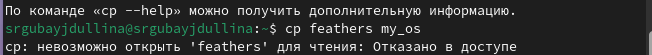{#fig:045 width=70%}

Лишаю прав доступа владельца на выполнение действий в каталоге play (рис. [-@fig:046]).

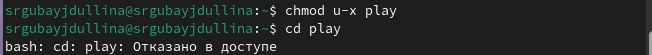{#fig:046 width=70%}

Восстанавливаю права на действия в каталоге play (рис. [-@fig:047]).

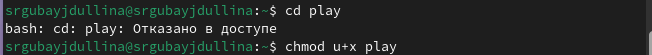{#fig:047 width=70%}

Далее по заданию проверяю команды при помощи утилиты man (рис. [-@fig:048]), (рис. [-@fig:049]), (рис. [-@fig:050]), (рис. [-@fig:051]).

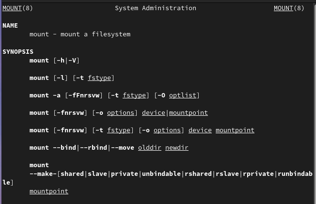{#fig:048 width=70%}

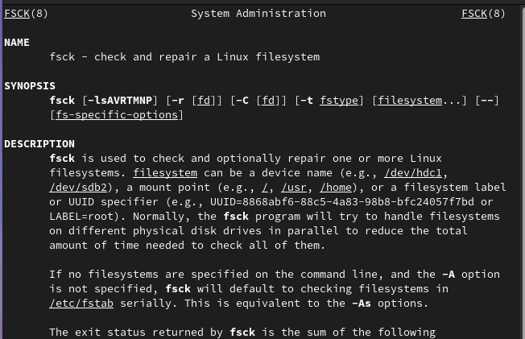{#fig:049 width=70%}

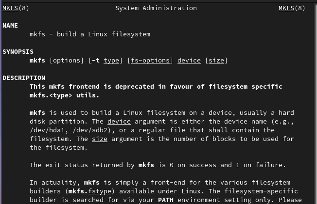{#fig:050 width=70%}

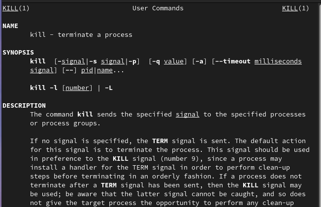{#fig:051 width=70%}

# Выводы

В ходе лабораторной работы я ознакомилась с файловой системой Linux, её структурой, именами и содержанием
каталогов. Приобрела практические навыки по применению команд для работы
с файлами и каталогами, по управлению процессами (и работами), по проверке использования диска и обслуживанию файловой системы.

# Список литературы{.unnumbered}

Лабораторная работа №7 (https://esystem.rudn.ru/pluginfile.php/2288087/mod_resource/content/4/005-lab_files.pdf)
